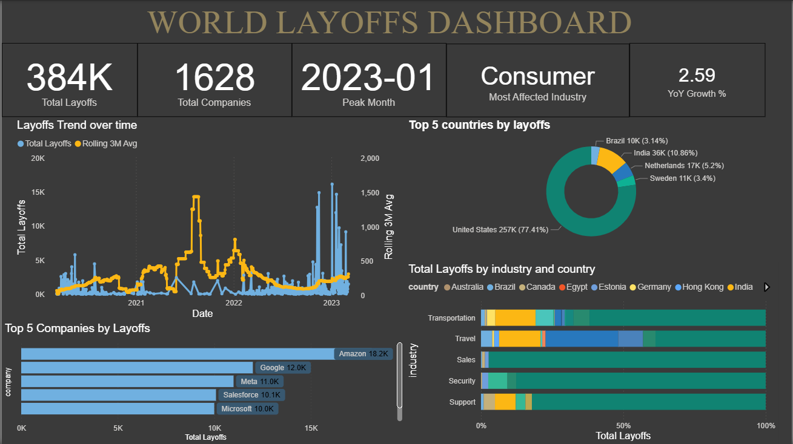
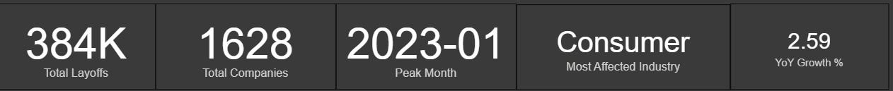
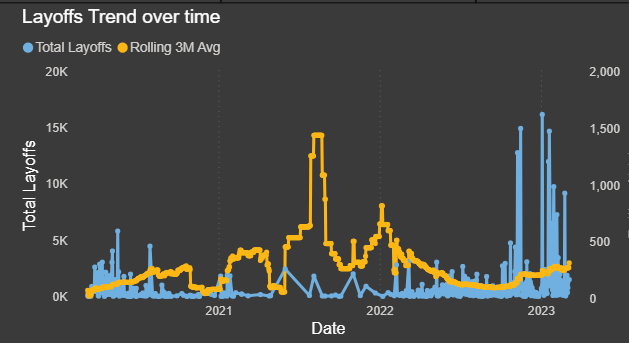
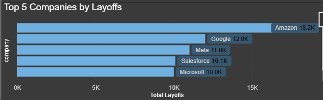
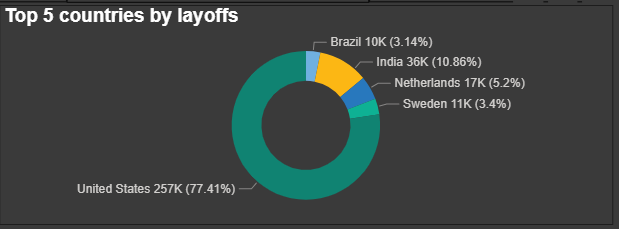
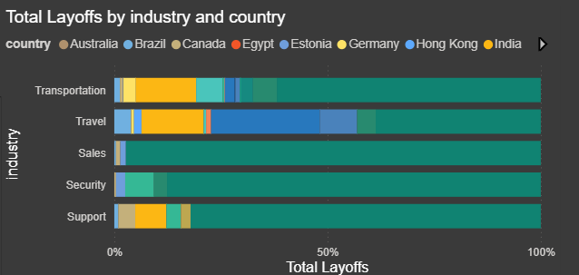

# 📊 World Layoffs Data Analysis & Dashboard (2021-2023)

## 📖 Project Overview
This project provides an end-to-end data pipeline and visual analysis of global corporate layoffs spanning from 2021 into early 2023. The primary objective was to take messy, real-world data, meticulously clean it using SQL, and build an interactive Power BI dashboard to uncover macroeconomic trends affecting various industries and global markets.

The project is broken down into two distinct phases:
1.  **Data Cleaning & Exploratory Data Analysis (EDA)** using advanced SQL techniques.
2.  **Data Visualization & Business Intelligence** using Power BI.

---

## 📸 Final Dashboard

---

## 🧹 Phase 1: Data Cleaning & Transformation (SQL)
Raw data requires rigorous cleaning before it can yield accurate insights. Using MySQL, I created staging tables (`layoffs_staging` and `layoffs_staging2`) to preserve the raw data while performing the following transformations:

* **Removing Duplicates:** Utilized Common Table Expressions (CTEs) and the `ROW_NUMBER()` window function partitioned across all columns to accurately identify and delete duplicate records.
* **Standardizing Data:** * Cleaned text fields by trimming whitespace.
  * Standardized category names (e.g., merging "crypto" variations into a single "Crypto" industry).
  * Removed trailing punctuation from geographic locations (e.g., standardizing "United States." to "United States").
* **Date Parsing:** Converted string-based date columns into standard SQL `DATE` format using `STR_TO_DATE()` for accurate time-series analysis.
* **Intelligent Data Imputation:** Addressed `NULL` and blank values in the `industry` column by writing a self-join query that populated missing data based on the company's historical entries.
* **Filtering:** Removed unanalyzable rows where both `total_laid_off` and `percentage_laid_off` were `NULL`.

### Key Exploratory Data Analysis (EDA) Queries
Once the data was cleaned, I ran several complex queries to uncover initial insights:
* **Rolling Totals:** Calculated the rolling total of layoffs month-over-month using a CTE and `SUM() OVER(ORDER BY month)`.
* **Yearly Rankings:** Used `DENSE_RANK()` within a CTE to determine the top 5 companies with the most layoffs per year.

---

## 📈 Phase 2: Power BI Dashboard & Visual Insights
The cleaned dataset was imported into Power BI to create a dynamic, interactive dashboard. 

### 1. High-Level KPIs
At a glance, the dataset encompasses **384K total layoffs** across **1628 companies**. The **Consumer** industry emerged as the most affected sector, with job losses peaking globally in **January 2023**.
 

### 2. Layoffs Trend Over Time
Tracking the volume of layoffs over time reveals a relatively stable environment through 2021, followed by extreme volatility and massive spikes beginning in late 2022. The orange 3-month rolling average line highlights the steep upward trajectory heading into 2023.
 

### 3. Top 5 Companies by Layoffs
The tech sector dominated the headcount reductions. **Amazon (18.2K)** led the absolute number of job cuts, followed closely by **Google (12.0K)**, **Meta (11.0K)**, **Salesforce (10.1K)**, and **Microsoft (10.0K)**.
 

### 4. Top 5 Countries Impacted
The geographic distribution of the data shows that the United States absorbed the vast majority of the impact, accounting for **77.41% (257K)** of all recorded layoffs, followed by India at 10.86%.
 

### 5. Industry Breakdown
An analysis of specific sectors (Transportation, Travel, Sales, Security, Support) visually reinforces the heavy concentration of these corporate restructurings within the United States market across all verticals.
 

---

## 🚀 How to Run This Project

1.  **SQL Setup:** * Import your raw layoff data into your SQL server.
    * Open and execute the `layoffs_data_cleaning.sql` script sequentially to stage, clean, and explore the data.
2.  **Power BI Dashboard:** * Download the `World_layoffs_dashboard.pbix` file.
    * Open it using Power BI Desktop to interact with the visual filters, tooltips, and DAX measures.
